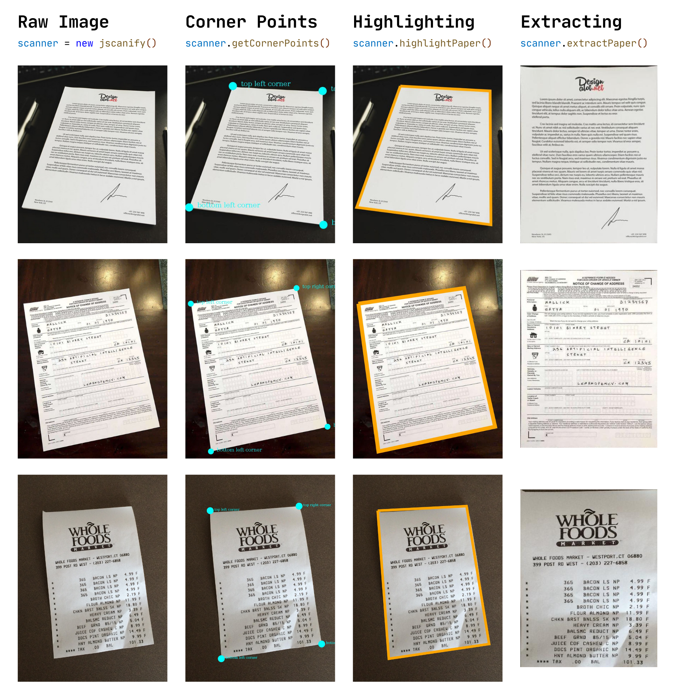

<p align="center">
    
</p>

<p align="center">
    <a href="https://www.jsdelivr.com/package/gh/ColonelParrot/jscanify"></a>
    <a href="https://cdnjs.com/libraries/jscanify"></a>
    <a href="https://npmjs.com/package/jscanify"></a>
    <br />
    <a href="https://github.com/puffinsoft/jscanify/blob/master/LICENSE"></a>
    <a href="https://npmjs.com/package/jscanify"></a>
</p>

<p align="center">
  <a href="https://npmjs.com/package/jscanify"></a>
</p>

<p align="center">
Powered with <a href="https://docs.opencv.org/3.4/d5/d10/tutorial_js_root.html">opencv.js</a><br/>
Supports the web, NodeJS, <a href="https://github.com/ColonelParrot/react-scanify-demo">React</a>, and others.
<br/>
Available on <a href="https://www.npmjs.com/package/jscanify">npm</a> or via <a href="https://www.jsdelivr.com/package/gh/ColonelParrot/jscanify">cdn</a><br/>
</p>

**Features**:

- paper detection & highlighting
- paper scanning with distortion correction

> [!IMPORTANT]  
> 🎉 _jscanify v1.3.0+_ has just been released! **Same API, better results.** See the [release](https://github.com/puffinsoft/jscanify/releases/tag/v1.3.0) to see the difference! 🎉


- 🆕 glare suppression
- 🆕 multi-colored paper support

<hr />



<h3 align="center" margin="0"><a href="https://github.com/puffinsoft/jscanify/wiki">➡️ view documentation</a></h3>

<hr/>

## Quickstart

> **Developers Note**: you can now use the [jscanify debugging tool](https://colonelparrot.github.io/jscanify/tester.html) to observe the result (highlighting, extraction) on test images.

### Import

npm:

```js
$ npm i jscanify
import jscanify from 'jscanify'
```

cdn:

```html
<script src="https://docs.opencv.org/4.7.0/opencv.js" async></script>
<!-- warning: loading OpenCV can take some time. Load asynchronously -->
<script src="https://cdn.jsdelivr.net/gh/ColonelParrot/jscanify@master/src/jscanify.min.js"></script>
```

> **Note**: jscanify on NodeJS is slightly different. See [wiki: use on NodeJS](https://github.com/puffinsoft/jscanify/wiki/Getting-started#use-on-nodejs).

### Highlight Paper in Image

```html

```

```js
const scanner = new jscanify();
image.onload = function () {
  const highlightedCanvas = scanner.highlightPaper(image);
  document.body.appendChild(highlightedCanvas);
};
```

### Extract Paper

```js
const scanner = new jscanify();
const paperWidth = 500;
const paperHeight = 1000;
image.onload = function () {
  const resultCanvas = scanner.extractPaper(image, paperWidth, paperHeight);
  document.body.appendChild(resultCanvas);
};
```

### Highlighting Paper in User Camera

The following code continuously reads from the user's camera and highlights the paper:

```html
<video id="video"></video> <canvas id="canvas"></canvas>
<!-- original video -->
<canvas id="result"></canvas>
<!-- highlighted video -->
```

```js
const scanner = new jscanify();
const canvasCtx = canvas.getContext("2d");
const resultCtx = result.getContext("2d");
navigator.mediaDevices.getUserMedia({ video: true }).then((stream) => {
  video.srcObject = stream;
  video.onloadedmetadata = () => {
    video.play();

    setInterval(() => {
      canvasCtx.drawImage(video, 0, 0);
      const resultCanvas = scanner.highlightPaper(canvas);
      resultCtx.drawImage(resultCanvas, 0, 0);
    }, 10);
  };
});
```

To export the paper to a PDF, see [here](https://stackoverflow.com/questions/23681325/convert-canvas-to-pdf)

### Notes

- for optimal paper detection, the paper should be placed on a flat surface with a solid background color
- we recommend wrapping your code using `jscanify` in a window `load` event listener to ensure OpenCV is loaded


<h3 align="center" margin="0"><a href="https://github.com/puffinsoft/jscanify/wiki">➡️ view documentation</a></h3>
