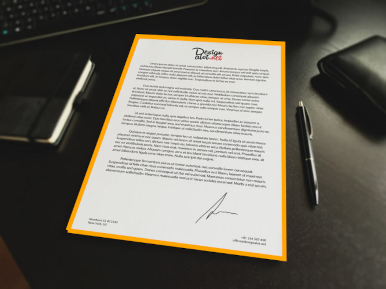
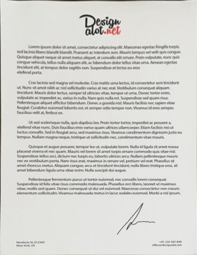
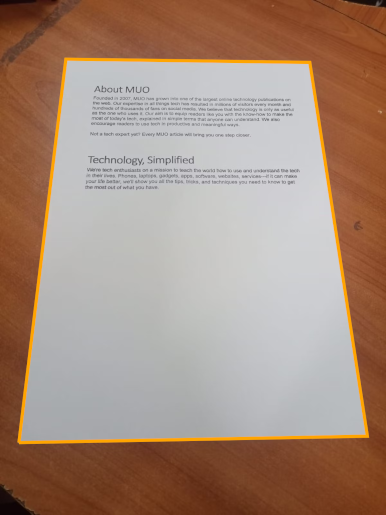
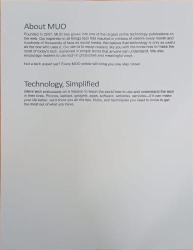

<p align="center">
    
</p>

<p align="center">
    <a href="https://www.jsdelivr.com/package/gh/ColonelParrot/jscanify"></a>
    <a href="https://cdnjs.com/libraries/jscanify"></a>
    <a href="https://npmjs.com/package/jscanify"></a>
    <br />
    <a href="https://github.com/ColonelParrot/jscanify/blob/master/LICENSE"></a>
    <a href="https://GitHub.com/ColonelParrot/jscanify/releases/"></a>
    <a href="https://npmjs.com/package/jscanify"></a>
</p>

<p align="center">
  <a href="https://nodei.co/npm/jscanify/"></a>
</p>

<p align="center">
Open-source pure Javascript implemented mobile document scanner. Powered with <a href="https://docs.opencv.org/3.4/d5/d10/tutorial_js_root.html">opencv.js</a><br/>
Supports the web, NodeJS, <a href="https://github.com/ColonelParrot/react-scanify-demo">React</a>, and others.
<br/><br/>
Available on <a href="https://www.npmjs.com/package/jscanify">npm</a> or via <a href="https://www.jsdelivr.com/package/gh/ColonelParrot/jscanify">cdn</a><br/>
</p>

**Features**:

- paper detection & highlighting
- paper scanning with distortion correction

| Image Highlighting                           | Scanned Result                             |
| -------------------------------------------- | ------------------------------------------ |
|  |  |
|  |  |

## Quickstart

### Import

npm:

```js
$ npm i jscanify
import jscanify from 'jscanify'
```

cdn:

```html
<script src="https://docs.opencv.org/4.7.0/opencv.js" async></script>
<!-- warning: loading OpenCV can take some time. Load asynchronously -->
<script src="https://cdn.jsdelivr.net/gh/ColonelParrot/jscanify@master/src/jscanify.min.js"></script>
```

> **Note**: jscanify on NodeJS is slightly different. See [wiki: use on NodeJS](https://github.com/ColonelParrot/jscanify/wiki#use-on-nodejs).

### Highlight Paper in Image

```html

```

```js
const scanner = new jscanify();
image.onload = function () {
  const highlightedCanvas = scanner.highlightPaper(image);
  document.body.appendChild(highlightedCanvas);
};
```

### Extract Paper

```js
const scanner = new jscanify();
const paperWidth = 500;
const paperHeight = 1000;
image.onload = function () {
  const resultCanvas = scanner.extractPaper(image, paperWidth, paperHeight);
  document.body.appendChild(resultCanvas);
};
```

### Highlighting Paper in User Camera

The following code continuously reads from the user's camera and highlights the paper:

```html
<canvas id="canvas"></canvas>
<!-- highlighted video -->
```

```js
const scanner = new jscanify();
const canvas = document.getElementById("canvas");
const canvasCtx = canvas.getContext("2d");

navigator.mediaDevices.getUserMedia({ video: true }).then((stream) => {

    const video = document.createElement('video');
    video.srcObject = stream;
    video.onloadedmetadata = () => {

        canvas.width = video.videoWidth;
        canvas.height = video.videoHeight;

        video.play();

        setInterval(() => {
            // Draw the video frame on the canvas
            canvasCtx.drawImage(video, 0, 0);

            // Highlight the paper and draw it on the same canvas
            const resultCanvas = scanner.highlightPaper(canvas);
            canvasCtx.clearRect(0, 0, canvas.width, canvas.height);  // Clear the canvas
            canvasCtx.drawImage(resultCanvas, 0, 0);  // Draw the highlighted paper
        }, 10);
    };
});

```

To export the paper to a PDF, see [here](https://stackoverflow.com/questions/23681325/convert-canvas-to-pdf)

### Notes

- for optimal paper detection, the paper should be placed on a flat surface with a solid background color
- we recommend wrapping your code using `jscanify` in a window `load` event listener to ensure OpenCV is loaded
